# az

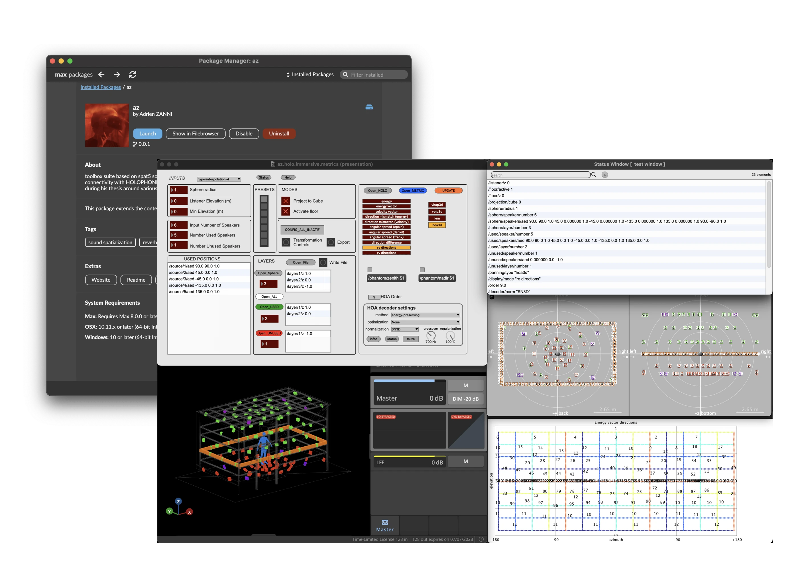

**az** is a Max (Cycling74') Package that focus on real-time spatialization, artificial reverberation, binaural, OSC control and connectivity with HOLOPHONIX Software. This package is a collection of tools around spatialization created by the author during his thesis around various concerts / events / festivals / installations. These tools are first experimentation of features, extensions tools from spat5, new proposition of interfaces for Max. Some of theses features if validated by experimentation and real life testing finished in commercial product [HOLOPHONIX](https://holophonix.xyz/).

<table>
  <tr>
    <th style="width: 50%;">Author</th>
    <th>Partners</th>
  </tr>
  <tr>
  <td colspan="2">
    Adrien ZANNI is a sound-engineer, sound scenographer, PhD student with Paris 8 University (EDESTA - MUSIDANCE/CICM Team) and lead developer of HOLOPHONIX.
  </td>
  </tr>
  <tr>
    <td>
      <ul>
        <li><a href="https://www.theses.fr/s256758">these.fr</a></li>
        <li><a href="https://www.linkedin.com/in/adrien-zanni-83730217b">LinkedIn</a></li>
        <li><a href="https://musidanse.univ-paris8.fr/adrien-zanni">Laboratoire</a></li>
        <li><a href="https://holophonix.xyz/company/team/adrien-zanni/">HOLOPHONIX</a></li>
      </ul>
    </td>
    <td>
      <ul>
        <li><a href="https://musidanse.univ-paris8.fr/centre-de-recherche-en-informatique-et-creation-musicale-cicm">Musidanse-CICM</a></li>
        <li><a href="https://holophonix.xyz/">HOLOPHONIX</a></li>
        <li><a href="https://amadeuslab.com/en/">Amadeus</a></li>
        <li><a href="https://www.ircam.fr/recherche/equipes-recherche/eac">IRCAM-EAC</a></li>
      </ul>
    </td>
  </tr>
</table>

### Dependencies

This toolbox as depencies on the Max packages : [spat5](https://forum.ircam.fr/projects/detail/spat/), [Bach](https://www.bachproject.net/) and [Dada](https://www.bachproject.net/dada/).

## Summary

- [Objects List](#list-of-objects)
- [Examples](#examples)

## List of Objects

- [az.holo.immersive.metrics](#azholoimmersivemetrics)
- [az.holo.monitoring](#azholomonitoring)
- [az.stereo.binaural~](#azstereobinaural)
- [az.stereo.ab~](#azstereoab)
- [az.holo.rectangle](#azholorectangle)
- [az.osc.store](#azoscstore)
- [az.osc.store.vanilla](#azoscstorevanilla)
- [az.osc.csv2coll](#azosccsv2coll)
- [az.osc.csv2osc](#azosccsv2osc)

### **az.holo.immersive.metrics**

_Ideal spherical system generator and algorithmic analysis linked to HOLOPHONIX speaker setups_

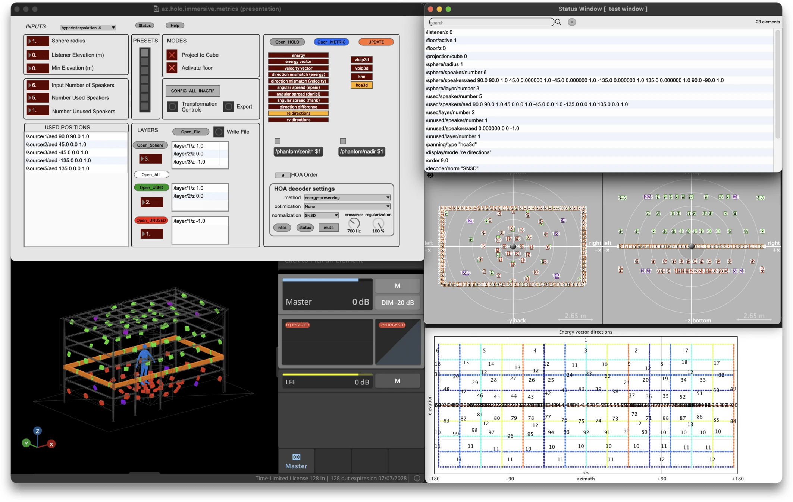

### **az.holo.monitoring**

_Binaural (6 DoF) monitoring from HOLOPHONIX outputs_

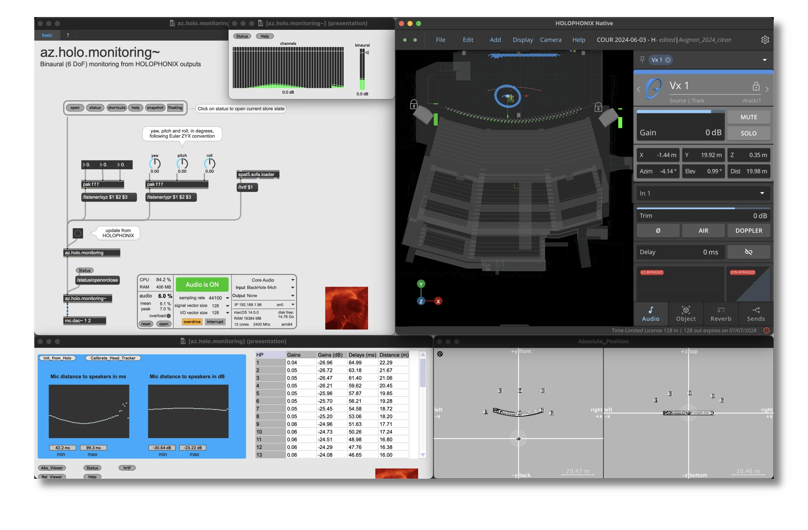

### **az.stereo.binaural~**

_Binaural (3 DoF) monitoring for stereo input with magLs method_

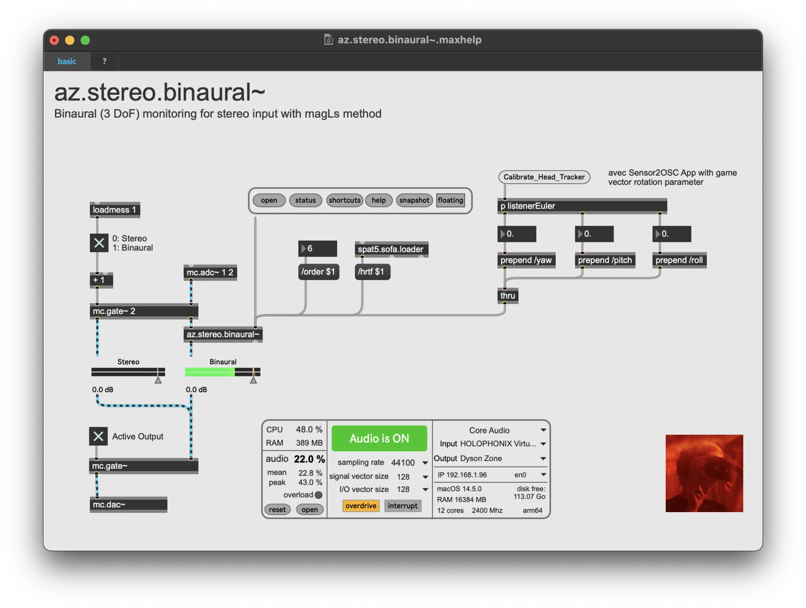

### **az.stereo.ab~**

_Virtual multi-microphonic simulator_

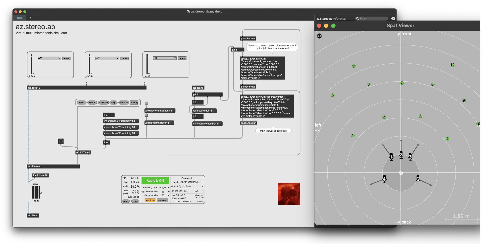

### **az.holo.rectangle**

_Arrange speakers on a rectangle path with orientation_

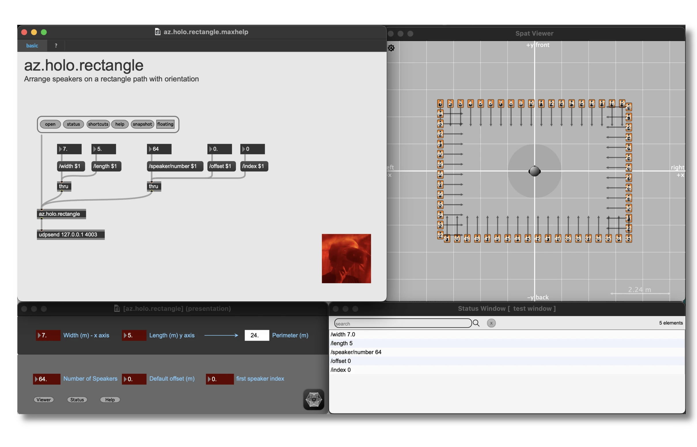

### **az.osc.store**

_Create an OSC Store to manage patcher states_

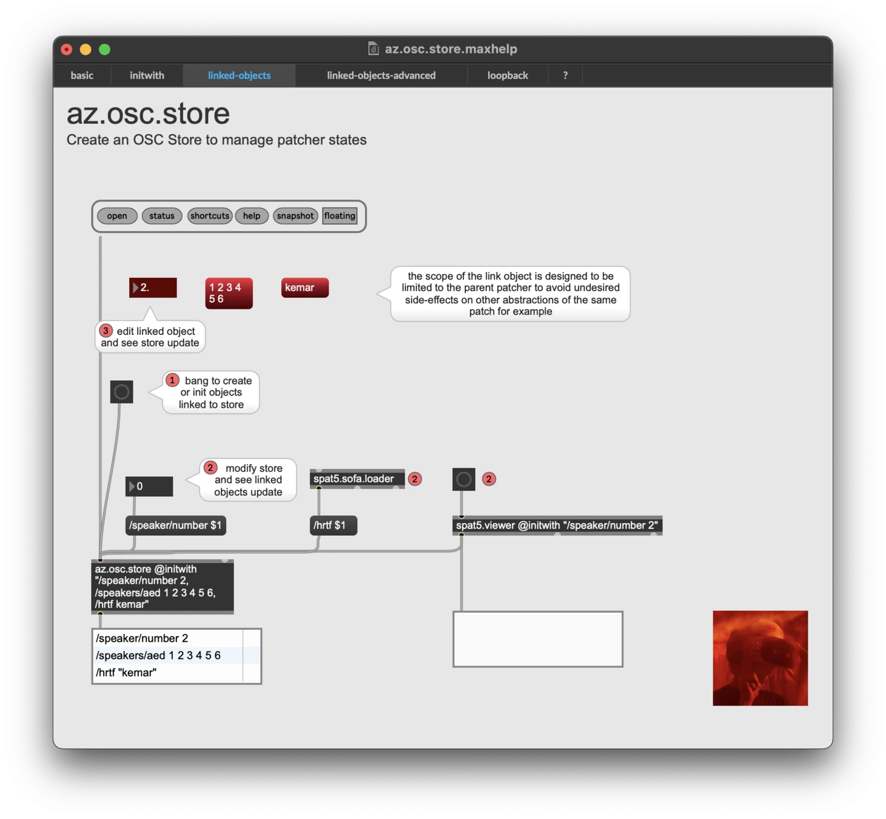

### **az.osc.store.vanilla**

_Create an OSC Store to manage patcher states / no external depencies_

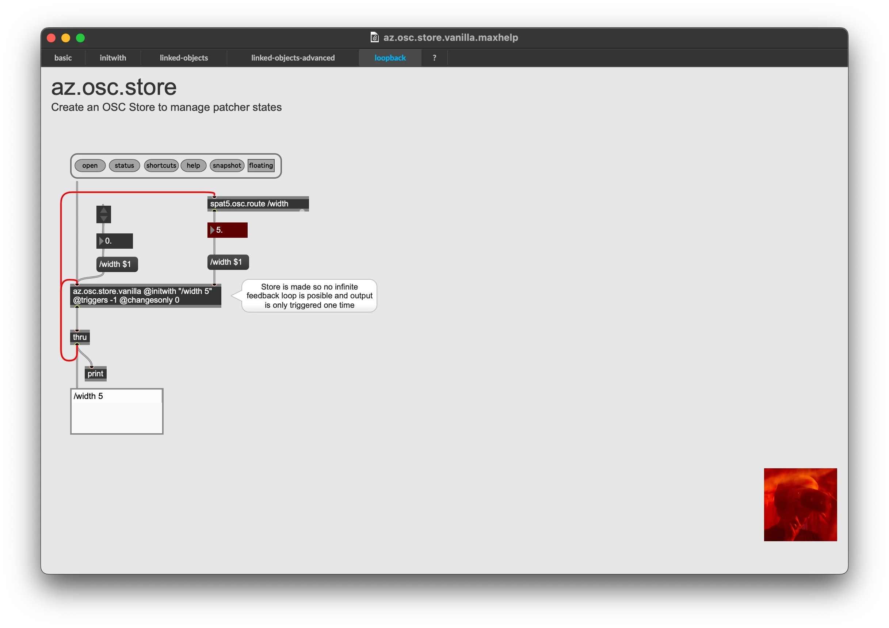

### **az.osc.csv2coll**

_Convert .csv file to coll_

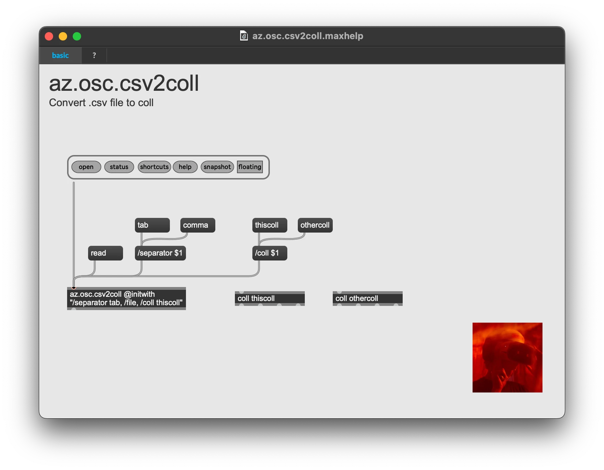

### **az.osc.csv2osc**

_Convert .csv file to osc messages_

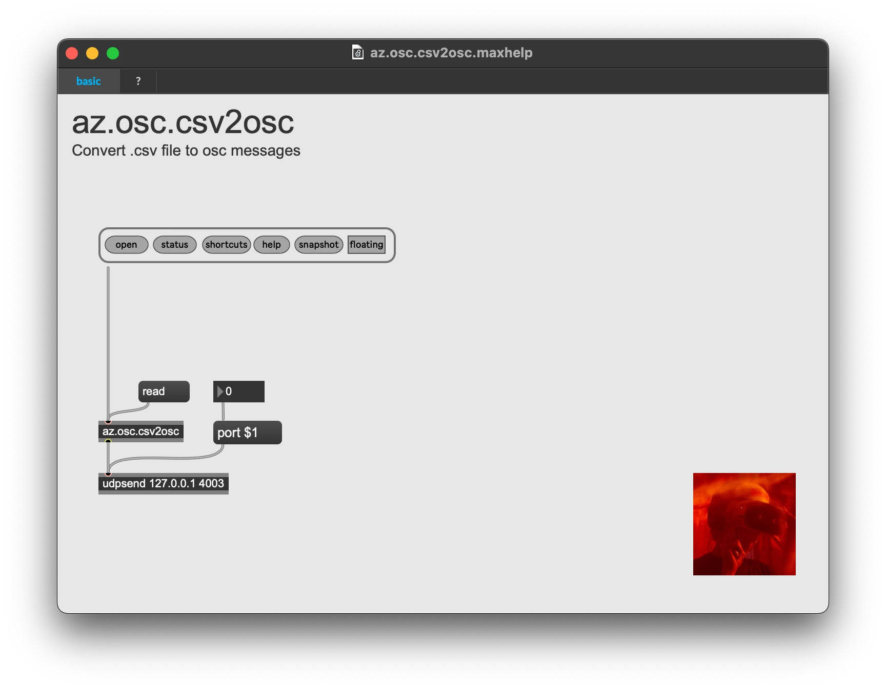

## Examples

- [ht.dada.boids.pantheon](#htdadaboidspantheon)

### **ht.dada.boids.pantheon**

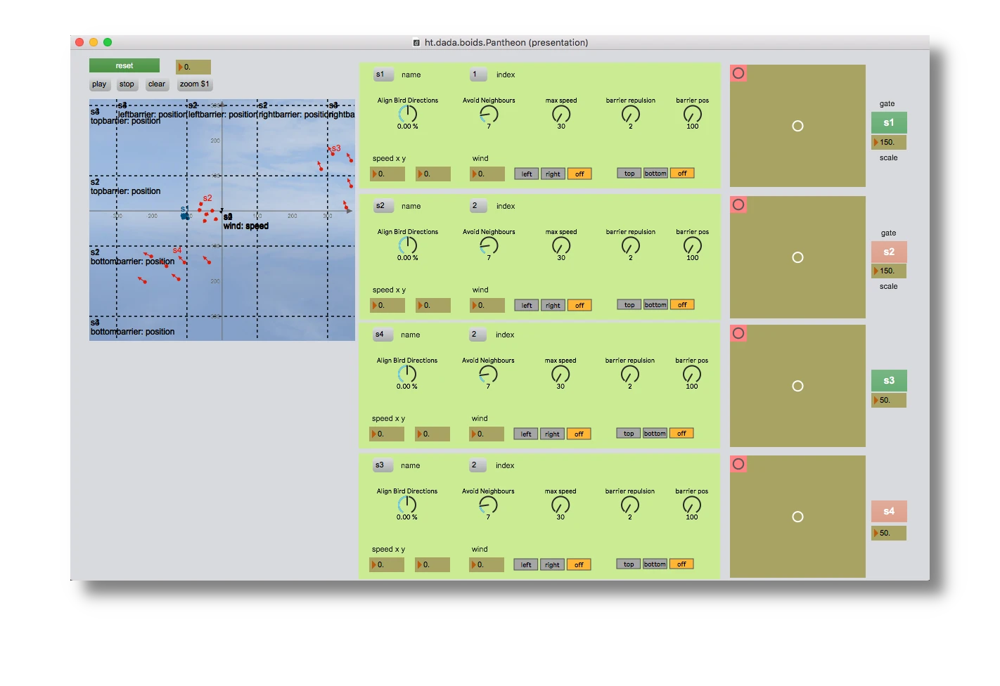
